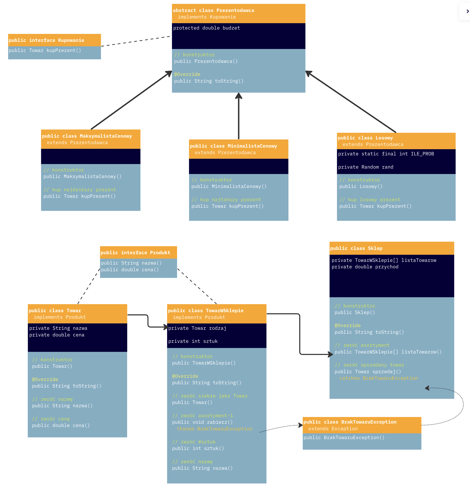

# Zakupy
Biblioteka klas reprezentujących kupowanie prezentów w sklepach, w ramach rozwiązania zadania zaliczeniowego z przedmiotu: "Programowanie i projektowanie obiektowe".

## Polecenie

### Pakiet <i>[zakupy](zakupy)</i>
Ma zawierać klasy reprezentujące działanie sklepu: [sklepy](zakupy/Sklep.java) oferują swoje [towary](zakupy/Towar.java) (w pewnej liczbie sztuk i cenie).

### Pakiet <i>[prezentodawcy](prezentodawcy)</i>
Ma zawierać klasy reprezentujące kupujących prezenty - dysponują oni pewnym budżetem na prezenty, i posługują się oni różnymi strategiami zakupów:
* [Maksymalista cenowy](prezentodawcy/MaksymalistaCenowy.java) wybiera najdroższy prezent mieszczący się w budżecie;
* [Maksymalista cenowy](prezentodawcy/MinimalistaCenowy.java) wybiera najtańszy prezent mieszczący się w budżecie;
* [Losowy](prezentodawcy/Losowy.java) losuje prezent kilka razy.

### Pakiet <i>[glowny](glowny)</i>
Biblioteka musi implementować poniższy kod (znajdujący się w klasie [Głównej](glowny/Glowna.java):
~~~java
Sklep sk0 = new Sklep(new TowarWSklepie[]{});  // Pusty sklep

Sklep sk1 = new Sklep(new TowarWSklepie[]{
        new TowarWSklepie(new Towar("DDR4 16GB", 350), 10),
        new TowarWSklepie(new Towar("SSD NVMe 512GB", 190), 5),
        new TowarWSklepie(new Towar("SSD NVMe 256GB", 99), 3),
        new TowarWSklepie(new Towar("SSD NVMe 1024GB", 460), 5),
        new TowarWSklepie(new Towar("DDR5 8GB", 415), 1),
        new TowarWSklepie(new Towar("Skarpetki", 15), 100)
});

Prezentodawca[] kupujacy = new Prezentodawca[]{
        new MaksymalistaCenowy(450),
        new MaksymalistaCenowy(450),
        new MinimalistaCenowy(200),
        new Losowy(600)
};

for(Prezentodawca pr: kupujacy){
    Towar prezent = pr.kupPrezent(sk0);
    if (prezent != null)
        System.out.printf(" > %s kupił %s%n", pr, prezent);
    else System.out.println(" > "+pr+" nic nie kupił");
}
~~~

## Diagram klas

